# 🏛️ CivicAI Portal — Comprehensive System Architecture & Workflow Specification

This document provides the complete end-to-end operational, architectural, and data workflow for the **CivicAI Portal** project.

---

## 📌 Executive Summary
**CivicAI** is an AI-powered municipal grievance redressal platform engineered to bridge citizens and municipal administration (e.g., Greater Chennai Corporation). The platform integrates:
- **Computer Vision (YOLOv8)** for automated defect detection (potholes, garbage dumps, water leakage, streetlight failures, drainage overflows).
- **Natural Language Processing (NLP & TF-IDF)** for bilingual (English & Tamil) department classification.
- **Spatio-Temporal Deduplication Engine** (Haversine distance &le; 50m) to group duplicate citizen tickets.
- **6-Tier Location Hierarchy** (Corporation &rarr; Zone &rarr; Ward &rarr; Locality &rarr; Street &rarr; GPS Landmark) for zero jurisdiction ambiguity.
- **Field Engineer Workflow & Dual-Proof Audit** with Before & After resolution photo verification.

---

## 🗺️ Mermaid Visual Workflow Diagram

```mermaid
flowchart TD
    %% Roles & Stakeholders
    classDef citizen fill:#0284c7,stroke:#38bdf8,stroke-width:2px,color:#ffffff;
    classDef aiEngine fill:#4338ca,stroke:#818cf8,stroke-width:2px,color:#ffffff;
    classDef dept fill:#b45309,stroke:#fbbf24,stroke-width:2px,color:#ffffff;
    classDef staff fill:#047857,stroke:#34d399,stroke-width:2px,color:#ffffff;
    classDef audit fill:#be185d,stroke:#f472b6,stroke-width:2px,color:#ffffff;

    subgraph PHASE1["1. Citizen Intake & Geocoding"]
        A1["Citizen captures photo & enters grievance (EN / TA)"]:::citizen
        A2["Selects 6-Tier Location + Interactive Leaflet GPS Pin"]:::citizen
        A3["System registers complaint with Token: GRV-2026-XXXXX"]:::citizen
        A1 --> A2 --> A3
    end

    subgraph PHASE2["2. AI Processing & Classification (FastAPI Microservice)"]
        B1["YOLOv8 Vision Inference: Detects defect & bounding boxes"]:::aiEngine
        B2["NLP Department Classifier: Maps text to Municipal Dept"]:::aiEngine
        B3["Deduplication Engine: Haversine distance (&le;50m) check"]:::aiEngine
        B4{"Is Duplicate?"}:::aiEngine
        B5["Link as Child to Parent Ticket (duplicateCount++)"]:::aiEngine
        B6["Calculate Severity (Low/Med/High/Critical) & Priority Score (0-100)"]:::aiEngine

        A3 --> B1
        B1 --> B2 --> B3 --> B4
        B4 -- Yes --> B5
        B4 -- No --> B6
    end

    subgraph PHASE3["3. Governance, SLA & Department Triage"]
        C1["Complaint marked as 'Verified'"]:::dept
        C2["Auto/Manual Dispatch to Ward Assistant Engineer"]:::dept
        C3["Status set to 'Assigned' & SLA Timer Starts (24h/48h/72h)"]:::dept
        
        B6 --> C1 --> C2 --> C3
    end

    subgraph PHASE4["4. Ground Field Resolution (Staff App)"]
        D1["Field Staff receives SMS/Push notification with GPS Route"]:::staff
        D2["Staff accepts ticket & updates status to 'In Progress'"]:::staff
        D3["Staff repairs physical defect on site"]:::staff
        D4["Staff uploads 'After-Resolution' proof image + repair notes"]:::staff
        D5["Status set to 'Resolution Submitted'"]:::staff

        C3 --> D1 --> D2 --> D3 --> D4 --> D5
    end

    subgraph PHASE5["5. Citizen Audit, Rating & Closure"]
        E1["Citizen receives resolution notification with Before/After proof"]:::audit
        E2{"Citizen Satisfied?"}:::audit
        E3["Citizen Confirms & Rates 1-5 Stars (Status: Closed)"]:::audit
        E4["Citizen Disputes/Reopens (Status: Reopened & Escalated)"]:::audit
        E5["Analytics Engine updates Ward Performance KPI & Heatmaps"]:::audit

        D5 --> E1 --> E2
        E2 -- Yes --> E3 --> E5
        E2 -- No --> E4 --> C2
    end
```



---

## 🏢 6-Tier Geographic Resolution Model

```
State (Tamil Nadu)
 └── Corporation (e.g., Greater Chennai Corporation)
      └── Zone (e.g., Zone 05 - Royapuram)
           └── Ward (e.g., Ward 045)
                └── Locality (e.g., George Town)
                     └── Street (e.g., NSC Bose Road)
                          └── Specific Landmark & GPS Lat/Long (13.0827° N, 80.2707° E)
```

---

## 📊 Lifecycle State Transition Matrix

| Step | Status Name | Trigger Actor | Next Allowed States | Description |
|---|---|---|---|---|
| **1** | `Submitted` | Citizen | `AI Processing` | Grievance stored, photo saved, geocoded. |
| **2** | `AI Processing` | AI Engine | `Verified`, `Duplicate` | YOLOv8 object detection, NLP classifier, deduplication. |
| **3** | `Verified` | AI Engine | `Assigned` | Validated civic issue with severity score (0-100). |
| **4** | `Assigned` | Department Admin | `In Progress` | Work order allocated to Ward Field Engineer. |
| **5** | `In Progress` | Field Staff | `Resolution Submitted` | Repair work underway on ground. |
| **6** | `Resolution Submitted` | Field Staff | `Citizen Confirmed`, `Reopened` | Geotagged After-Image uploaded as proof. |
| **7** | `Citizen Confirmed` | Citizen | `Closed` | Citizen reviews Before/After proof and confirms. |
| **8** | `Closed` | System | _Final_ | Ticket archived; metrics fed to executive dashboard. |
| **9** | `Reopened` | Citizen / Admin | `In Progress`, `Assigned` | Citizen disputes resolution; escalates to Zonal Head. |
| **10**| `Duplicate` | AI Engine | `Closed` | Linked to active parent ticket within 50m radius. |

---

## 🖨️ How to Print the A3 Workflow Poster

We have generated an A3 Landscape poster file ready for printing:
📁 **File Path**: `e:\civic issue\civic-ai\CIVIC_AI_WORKFLOW_A3_POSTER.html`

### 3-Step Printing Instructions:
1. Open the file `CIVIC_AI_WORKFLOW_A3_POSTER.html` in **Google Chrome** or **Microsoft Edge**.
2. Press <kbd>Ctrl</kbd> + <kbd>P</kbd> (or click the floating **"🖨️ Print to A3 / Save PDF"** button).
3. In the Print Settings dialog:
   - **Destination**: `Save as PDF` or select your `A3 Color Printer`
   - **Paper Size**: `A3`
   - **Orientation**: `Landscape`
   - **Margins**: `None` or `Default`
   - **Options**: Check ✅ **"Background graphics"**
   - Click **Save / Print**.
